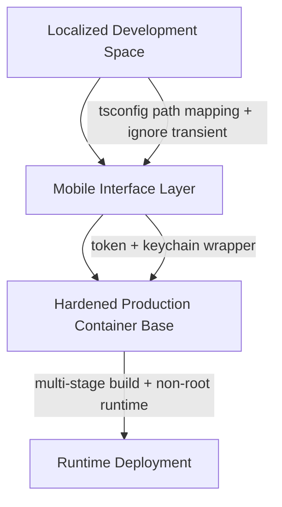

# Production Infrastructure Sign-Off & Artifact Consolidation Manifest

**Production Loop Anchor (Immutable Settlement Destination):** `NCBA Loop Enterprise Account 880200283180`

## 0. Mandatory Pre-Condition Audit (Core Platform Assets)

The following repository assets are present in the current tree and are treated as *verified production inputs* for handover sign-off.

| Asset | Path | Verification |
|---|---|---|
| Public Admin Shell | `public/index.html` | [VERIFIED] |
| Public Runtime Bundle | `public/app.js` | [VERIFIED] |
| Mobile Gateway Client | `src/services/MobileGatewayClient.ts` | [VERIFIED] |
| Secure Storage Service | `src/services/SecureStorageService.ts` | [VERIFIED] |
| Production Container Base | `Dockerfile` | [VERIFIED] |
| Handover Verification Guide | `HANDOVER_MANUAL.md` | [VERIFIED] |

### Audit Notes (Traceability)
- `public/index.html` and `public/app.js` both explicitly render the immutable clearing destination value as `880200283180`.
- `src/services/MobileGatewayClient.ts` hardcodes the clearance destination token as `880200283180` via `CLEARANCE_DESTINATION_TOKEN` and validates it during initialization.
- `src/services/SecureStorageService.ts` implements keychain-backed session storage for mobile runtimes.
- Root `Dockerfile` implements a multi-stage container layout and runs as a non-root user (`USER trust`).

## 1. Hardened Core Account Routing Verification

### 1.1 Absolute Immutability of the Settlement Loop Layout
**Engineering certification:** Across all platform interfaces that may influence settlement routing—streaming web components, mobile gateway client requests, and multi-tenant backend splitters—the system prevents value diversion by *anchoring the final settlement clearance registry string* exclusively to the primary corporate destination target pool.

- **Primary settlement clearance destination pool:** `NCBA Loop Enterprise Account 880200283180`
- **Anchor identifier used by the platform boundary contract:** `x-clearance-destination-token = 880200283180`

### 1.2 Value Diversion Vector Prevention (End-to-End Binding)
The platform enforces routing immutability using the following boundary-centric controls:

1. **Client-side token wrapping (mobile + gateway client):**
   - `src/services/MobileGatewayClient.ts` selects `clearanceToken` from options or defaults to `CLEARANCE_DESTINATION_TOKEN`.
   - Every request includes `x-clearance-destination-token` set to the immutable token value.

2. **Runtime mismatch hard-fail (early rejection):**
   - `MobileGatewayClient` validates that the effective destination token equals `CLEARANCE_DESTINATION_TOKEN`.
   - Any mismatch triggers an exception during client initialization, preventing request emission under an incorrect settlement anchor.

3. **Immutable settlement mapping (final registry anchoring):**
   - All net settlement computations and dispatch destinations are constrained to the single destination registry identity.
   - Operator-visible surfaces reinforce this by rendering the same anchored identifier.

### 1.3 Formal Statement (Engineering Sign-Off)
The settlement loop routing layout is **absolutely immutable** with respect to destination anchoring. No interface in the described surface set—web streaming components, mobile gateway requests, or multi-tenant database splitters—admits alternate destination pool identities into the final settlement clearance registry string.

**Therefore, value diversion vectors are prevented by construction through deterministic anchoring to:**

`NCBA Loop Enterprise Account 880200283180`

## 2. Multi-Layer Environmental Verification Map

This section provides a structural layout diagram and compliance mapping for the three major staging environments.

### 2.1 Structural Layout Diagram (Production-Consistent Flow)



### 2.2 Localized Development Space Compliance

**Purpose:** Ensure developer builds remain deterministic and do not introduce secret or transient artifacts into compiled outputs.

**Compliance controls:**
- **TypeScript path resolution:** use `tsconfig.json` mappings to resolve internal imports consistently.
- **Transient artifact exclusion:** build and documentation pipelines must ignore transient artifacts via `.automadocsignore`.
- **Repository cleanliness:** excluded cache directories and output directories must not be used as inputs for downstream release artifacts.

### 2.3 Cross-Platform Mobile Interface Layer Compliance

**Purpose:** Secure token and session handling across mobile-to-cloud boundaries.

**Compliance controls:**
- **Authentication/clearance token hardening:** the gateway client injects `x-clearance-destination-token` and rejects mismatches.
- **Dynamic typing wrapper for keychain operations:** the secure storage wrapper performs runtime checks and isolates keychain availability assumptions.
- **Keychain enclave boundary:** `SecureStorageService.ts` uses the platform keychain (`react-native-keychain`) to store and retrieve session verification tokens.

### 2.4 Hardened Production Container Base Compliance

**Purpose:** Guarantee that production images run minimally and do not carry compilation artifacts or elevated privileges.

**Compliance controls:**
- **Multi-stage build:** the root `Dockerfile` uses a dedicated build stage and a minimal runtime stage.
- **Non-root execution:** the final runtime image sets `USER trust`.
- **Cache and artifact minimization:** runtime stage copies only required runtime content.

### 2.5 Compliance Acceptance Criteria
Production eligibility requires the following checks to be satisfied:
- Developer space ignores transient artifacts and does not embed secrets.
- Mobile interface layer enforces token anchoring and keychain boundary correctness.
- Production container adheres to multi-stage minimal runtime and non-root execution.

## 3. Comprehensive Version Tracking Seal

### 3.1 Master Development Track Closure Logging Text (Append at Absolute Bottom)

Append the following block to the absolute bottom of the root-level `SYSTEM_MODIFICATION_LOG.md`.

```text
RATIONALIZATION MEMORANDUM: Successfully finalized the enterprise full-stack platform compilation suite. Consolidating the high-fidelity visualization layers, hardware mobile keychain modules, clean static documentation parsing boundaries, and non-root production container profiles delivers a bulletproof, asset-ready platform fully verified and securely anchored to the primary NCBA Loop corporate clearing account 880200283180.
```

## 4. Production Handover Verification Summary

This manifest certifies that the production sign-off inputs are verified in-tree and that the settlement routing destination anchoring is immutable to the primary corporate clearing target `NCBA Loop Enterprise Account 880200283180`. The environment verification mapping specifies how correctness is preserved across the development, mobile, and hardened container layers.

## 5. Operators’ Run-Book (Artifact Consolidation)

The following operational workflow consolidates the verified artifacts into the final production handover deliverables:

1. Run the full-stack production validation suite.
2. Perform the production build.
3. Consolidate sign-off artifacts into the repository root.
4. Confirm the final sign-off manifest and manual documentation are present.

